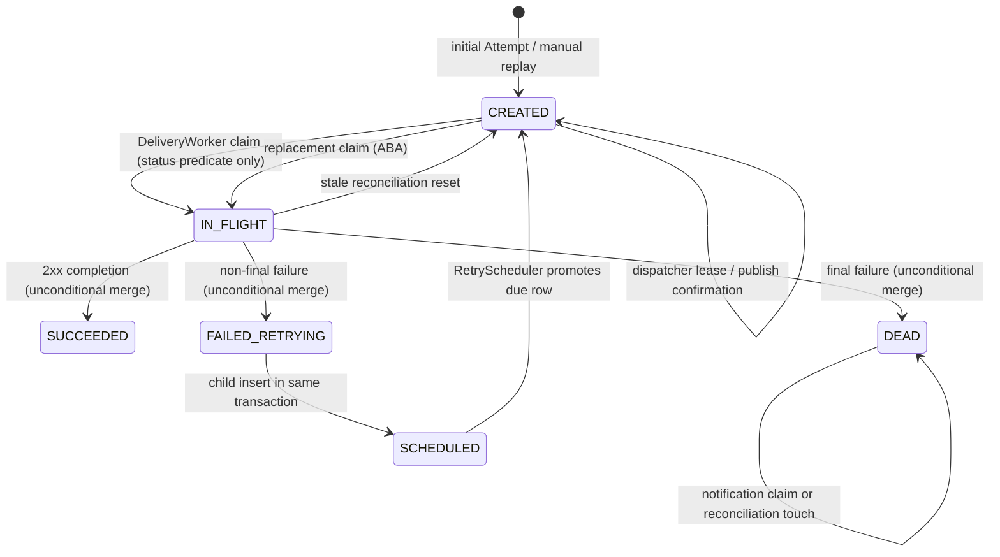

# P04 — Execution Ownership and Stale-Worker Fencing Design

**Date:** 2026-10-01

**Status:** Design complete; implementation not started

**Scope:** Attempt execution ownership, fenced completion, stale `IN_FLIGHT` recovery, and duplicate/stale Rabbit task handling
**Out of scope:** exactly-once delivery, receiver idempotency, replay sequence allocation (P05), scheduler architecture (P06), retry-count/delay changes, and redesign of P01/P02/P03

## 1. Decision summary

Relay will give every successful `CREATED -> IN_FLIGHT` claim a monotonically increasing
`execution_generation`. The worker carries that generation with the loaded Attempt. Every authoritative completion
uses a conditional database update with all three predicates:

```sql
WHERE id = :attempt_id
  AND status = 'IN_FLIGHT'
  AND execution_generation = :execution_generation
  AND execution_generation > 0
```

Generation 0 is reserved as a migration sentinel for pre-V12 `IN_FLIGHT` rows. It is recoverable by reconciliation
but is never a valid new-protocol completion capability.

Reconciliation revokes an execution with an atomic, generation-scoped `IN_FLIGHT -> CREATED` update and clears its
claim timestamp. A later claim increments the generation. This fences the old worker both during the intervening
`CREATED` gap and after the row returns to `IN_FLIGHT` (the ABA case).

`markFailedAndCreateRetry` first performs the fenced parent update and creates the retry child only when that update
affects one row, in the same transaction. Zero rows means ownership was lost: no retry or dead-letter publication is
created, current state is not overwritten, the event is logged/counted as superseded execution, and the worker's
future completes normally so Rabbit acknowledges the obsolete delivery.

The existing ready-publication claim UUID remains unchanged and separate. It fences dispatcher confirmation, not HTTP
execution.

## 2. Current execution/state topology

### 2.1 Ready work and Rabbit publication

1. Initial Attempts and replay Attempts enter `CREATED`; automatic retry children enter `SCHEDULED`.
2. `RetryScheduler.releaseDueRetries()` calls `ReadyWorkRepositoryImpl.promoteDueScheduled()`. PostgreSQL selects due
   `SCHEDULED` rows with `FOR UPDATE SKIP LOCKED`, changes them to `CREATED`, and clears ready-publication state.
3. `ReadyWorkDispatcher.dispatchOnce()` creates one random dispatcher claim UUID for the batch.
4. `ReadyWorkRepositoryImpl.claimUnpublishedReady()` uses `FOR UPDATE SKIP LOCKED` to lease eligible `CREATED` rows by
   setting `ready_dispatch_claim_id` and `ready_dispatch_claimed_at`.
5. `AttemptPublisher.publishReady()` publishes a persistent Attempt-ID message to `delivery.tasks` with correlated
   publisher confirms and mandatory routing.
6. On a confirmed, routable publish, `markReadyPublished()` conditionally sets `ready_published_at` and clears the
   dispatcher lease using `id + status CREATED + ready_published_at IS NULL + ready_dispatch_claim_id`.
7. Ambiguous/failed publication leaves the row unconfirmed. A later dispatcher may reclaim the ready-publication lease.

The ready-dispatch claim may cover a batch, is cleared at confirmation, and normally no longer exists when HTTP
execution starts. It cannot identify an execution owner.

### 2.2 Worker execution

`DeliveryWorker.onMessage()` returns `CompletableFuture<Void>` and schedules `processMessage()` on the virtual-thread
executor. Spring AMQP owns acknowledgment:

- normal future completion -> ack;
- exceptional future completion -> reject;
- `spring.rabbitmq.listener.simple.default-requeue-rejected=false` -> rejection does not requeue;
- process/connection death before settlement -> Rabbit can redeliver.

`processMessage()` parses the Attempt UUID, calls `AttemptService.claim()`, then independently loads the Attempt. The
current claim SQL is:

```sql
UPDATE attempts
SET status = 'IN_FLIGHT', updated_at = :now
WHERE id = :attempt_id
  AND status = 'CREATED';
```

Only one concurrent task can claim a `CREATED` row. After that transaction commits, the worker holds a detached
`Attempt`. It serializes the persisted Message once to UTF-8 bytes, signs and transmits that same byte array, and uses
the P03 Apache transport. Expected URI, DNS/policy, connection, TLS, I/O, timeout, and response-capture failures are
modeled as `WebhookDeliveryException`; unexpected runtime failures remain exceptional.

### 2.3 Completion and retry creation

The completion methods are independent `@Transactional` service calls:

- `markSucceeded()` mutates the detached entity and calls `AttemptRepository.save()`;
- `markFailed()` mutates the detached entity and calls `save()`;
- `markFailedAndCreateRetry()` calls `markFailed()`, flushes the parent update, then inserts a `SCHEDULED` child;
- attempt 6 calls `markFailed(... DEAD ...)`, commits, then publishes to `delivery.deadletter` outside that transaction.

Because Attempt has no `@Version`, `save()` merges by primary key. The observed PostgreSQL/Hibernate completion SQL is:

```sql
UPDATE attempts
SET dead_letter_notified_at = ?,
    last_error = ?,
    latency_ms = ?,
    next_retry_at = ?,
    ready_dispatch_claim_id = ?,
    ready_dispatch_claimed_at = ?,
    ready_published_at = ?,
    response_body = ?,
    response_code = ?,
    status = ?,
    updated_at = ?
WHERE id = ?;
```

The only predicate is the primary key. Status and ownership are neither checked nor compared.

### 2.4 Reconciliation

Every sweep calculates `threshold = application_now - 90s`, selects `IN_FLIGHT` Attempts by `updated_at`, and calls:

```sql
UPDATE attempts
SET status = 'CREATED',
    ready_published_at = NULL,
    ready_dispatch_claim_id = NULL,
    ready_dispatch_claimed_at = NULL,
    updated_at = :now
WHERE id = :attempt_id
  AND status = 'IN_FLIGHT'
  AND updated_at < :threshold;
```

The second predicate protects a completion that wins before reset. It does not invalidate the detached entity held by
the reset execution. The reset row is subsequently republished only by the ready-work dispatcher.

### 2.5 Manual replay

`DeliveryReplayService` creates a new Attempt row under the existing Delivery. That new row naturally acquires its own
execution generation when claimed. P04 applies to replay-created Attempts exactly as it applies to initial and retry
Attempts. P04 does not change replay eligibility or attempt-number allocation; the independently reproduced stale
replay race remains P05.

### 2.6 Dead-letter notification

After a valid final failure commits `DEAD`, the worker publishes the Attempt ID to `delivery.deadletter`.
`DeadLetterNotifier` sends email and atomically claims `dead_letter_notified_at`; reconciliation republishes old,
unnotified `DEAD` rows. P04 must prevent a stale execution from creating `DEAD` or publishing its notification intent.
It does not redesign notification idempotency.

## 3. Current state-transition diagram



The diagram's completion arrows are nominal. Today an old detached entity can also perform `SUCCEEDED ->
FAILED_RETRYING`, `FAILED_RETRYING -> SUCCEEDED`, or `CREATED -> SUCCEEDED` because the generated SQL has no status
predicate.

## 4. Post-claim mutation audit

| Mutation | Caller | Transaction | Current precondition / SQL predicate | Ownership checked? | Concurrent change result |
|---|---|---|---|---|---|
| `CREATED -> IN_FLIGHT` | `DeliveryWorker` via `AttemptService.claim` | one service transaction | `id AND status='CREATED'` | Only status; no execution identity | loser gets row count 0 and returns normally |
| `IN_FLIGHT -> SUCCEEDED` | worker 2xx path | one `markSucceeded` transaction | merge by `id` | No | overwrites any committed state for that ID |
| `IN_FLIGHT -> FAILED_RETRYING` | worker non-final HTTP/policy/DNS/transport/timeout path | outer `markFailedAndCreateRetry` transaction | merge by `id` | No | overwrites any committed state |
| Retry child insert | `markFailedAndCreateRetry` | same transaction as parent update | no owner predicate; active-attempt unique index may reject | No | child commits if index is free; transaction rolls back only on constraint collision |
| `IN_FLIGHT -> DEAD` | worker final failure path | one `markFailed` transaction | merge by `id` | No | stale owner can overwrite newer state |
| Dead-letter publish | worker after `DEAD` commit | no shared DB/Rabbit transaction | none | Relies on preceding unfenced write | stale owner can publish notification work |
| `IN_FLIGHT -> CREATED` | reconciliation | one native-update transaction | `id + status IN_FLIGHT + updated_at<threshold` | No owner identity | completion-before-reset wins; reset-before-completion does not fence worker |
| Ready marker clear/lease changes | scheduler/dispatcher/reconciliation | separate short transactions | status plus dispatcher claim where applicable | Dispatcher ownership only | fenced for publication, unrelated to execution |
| Dead notification/touch | notifier/reconciliation | separate transactions | notification/timestamp predicates | Not execution ownership | idempotent notification coordination after valid `DEAD` |

### 4.1 Complete production Attempt-state-writer audit

The audit searched production Java and Flyway sources for `setStatus`, `new Attempt`, every `AttemptRepository.save*`
call, every `UPDATE attempts`, and every status predicate. The production writer set is closed as follows:

| Writer | Transition or mutation | Ownership domain | Current/planned predicate | May operate on `IN_FLIGHT`? | Constraint/fencing compatibility |
|---|---|---|---|---|---|
| `Attempt` constructor via `createFromSubscriptionList` | insert `CREATED` | initial fan-out | new row | No | inserts null claim time and generation 0 |
| `AttemptService.createRetry` | insert `SCHEDULED` | automatic retry allocation | called only after parent failure | No | inserts null claim time and generation 0; P04 fences the parent before this call |
| `AttemptService.createReplay` | insert `CREATED` | manual replay allocation | replay eligibility plus active-row constraint | No | inserts null claim time and generation 0; P05 remains responsible for allocation |
| Current `AttemptRepository.claim`; planned `AttemptExecutionRepository.claim` | `CREATED -> IN_FLIGHT` | execution acquisition | current: `id + CREATED`; planned: same plus atomic generation increment | Enters it | planned SQL sets positive generation and non-null claim time in the same statement |
| Current `markSucceeded` entity merge; planned fenced SQL | `IN_FLIGHT -> SUCCEEDED` | execution completion | current: `id`; planned: `id + IN_FLIGHT + generation + generation>0` | Leaves it | planned SQL clears claim time atomically |
| Current `markFailed`; planned fenced SQL | `IN_FLIGHT -> FAILED_RETRYING` or `DEAD` | execution completion | current: `id`; planned: `id + IN_FLIGHT + generation + generation>0` | Leaves it | planned SQL clears claim time atomically; only applied `DEAD` may publish notification work |
| Current `AttemptRepository.resetStuck`; planned generation-scoped reset | `IN_FLIGHT -> CREATED` | execution recovery | current: `id + IN_FLIGHT + updated_at age`; planned: `id + IN_FLIGHT + observed generation + claimed_at age` | Leaves it | planned SQL clears claim time and ready-publication state atomically; generation 0 is allowed here |
| `ReadyWorkRepositoryImpl.promoteDueScheduled` | `SCHEDULED -> CREATED` | retry scheduling | due time, status, row lock with `SKIP LOCKED` | No | both states require null claim time; generation remains unchanged |
| `claimUnpublishedReady` | ready-dispatch lease fields only on `CREATED` | ready publication | `CREATED`, unpublished, expired/unset dispatch lease | No | does not change execution status/generation/claim time |
| `markReadyPublished` | ready publication fields only on `CREATED` | ready publication | `id + CREATED + unpublished + dispatch claim UUID` | No | does not change execution status/generation/claim time |
| `touchDeadLetterCandidate` | `updated_at` only | notification recovery | `id + DEAD + unnotified + age` | No | does not change status or execution claim time |
| `claimDeadLetterNotification` | `dead_letter_notified_at` only | notification delivery | `id + unnotified`; caller supplies a DEAD-task ID | SQL could match it | status and claim time are unchanged, so it cannot enter/leave `IN_FLIGHT` or authorize completion |
| V5 migration backfill | `delivery_id` only | historical schema migration | rows lacking Delivery link | It can update any historical status | does not change status or claim time; V12 runs later |
| V12 migration backfill | set claim time on existing `IN_FLIGHT` rows | migration recovery | `status='IN_FLIGHT'` | Yes | establishes the constraint while retaining generation 0 as recovery-only |
| `ScheduledStatusConstraintGuard` | catalog read only | schema validation | checks status constraint definition | No | no Attempt row mutation |

There are no other production `Attempt.status` setters, `AttemptRepository.save*` writers, or hand-written Attempt
lifecycle updates. `DeliveryQueryService` and repository finder/specification methods are read-only. After P04, the
generic status setter remains a domain construction convenience for `SCHEDULED` only; the final audit must fail if any
production call sets `IN_FLIGHT` or a terminal status directly.

### 4.2 Consistency-constraint decision

Keep:

```sql
CHECK ((status = 'IN_FLIGHT') = (execution_claimed_at IS NOT NULL))
```

Every audited transition is compatible: the sole entry into `IN_FLIGHT` sets the timestamp atomically; the sole
completion and recovery exits clear it atomically; all non-execution transitions stay between states that require null.
Field-only publication/notification writers preserve both sides of the equality.

The constraint is an intentional future bypass detector. A new writer that sets `IN_FLIGHT` without acquiring a claim,
or leaves `IN_FLIGHT` without clearing the claim, must fail at the database boundary even if a code review or grep
misses it. Repository tests must exercise both rejected bypass shapes. The constraint does not replace the generation
predicate: it detects missing claim-state coupling but cannot distinguish A from B after ABA.

## 5. Reproduced correctness defects

### 5.1 Method

A temporary investigation harness outside repository sources used PostgreSQL 16, the current Flyway migrations, actual
`AttemptService`/repositories, and ordered committed transactions. It did not modify production or test code. The
historical `docs/reviews/probes/ReadinessProbe.java` Sequence A was re-run against current services and extended for B,
the `CREATED` gap, and competing failures.

### 5.2 Sequence A — stale failure after newer success

Committed result:

```text
attempt 1: FAILED_RETRYING, HTTP 500, body/error from A
attempt 2: SCHEDULED
```

B's committed `SUCCEEDED`, HTTP 200, body, and latency were overwritten. A created authoritative successor work.

### 5.3 Sequence B — stale success after newer failure/retry

Committed result:

```text
attempt 1: SUCCEEDED, HTTP 200, body/latency from A
attempt 2: SCHEDULED (created by B)
```

The Delivery appears successful while an automatic retry remains scheduled. The parent/child history is inconsistent.

### 5.4 Reset-to-claim gap

A claimed, reconciliation reset the row, and A completed before B claimed. A's stale success changed `CREATED ->
SUCCEEDED`; B's subsequent claim returned false. Therefore `CREATED` is not sufficient protection unless every
completion itself requires `IN_FLIGHT`.

### 5.5 Competing failures

- While the first retry child remains active, a second failure updates the parent and attempts another child insert.
  `idx_attempts_one_active_per_message_endpoint` rejects the insert and the transaction rolls back. This happens by
  incidental uniqueness, not ownership fencing, and surfaces as an unexpected persistence exception.
- After the first child becomes terminal, the same stale failure commits another `SCHEDULED` child with the same
  `attempt_no`. There is no unique `(delivery_id, attempt_no)` constraint. P05 owns general sequence allocation, but
  P04 must stop this particular stale owner before it can insert any child.

## 6. Root cause

The row has claimability but no durable execution identity. `status=IN_FLIGHT` says some execution exists; it cannot
say which execution. Reconciliation creates an ABA cycle:

```text
IN_FLIGHT(A) -> CREATED -> IN_FLIGHT(B)
```

A and B hold entities with the same Attempt ID and indistinguishable authority. Completion merge is an unconditional
last-writer-wins update. Transactional parent failure plus child creation preserves atomicity but does not validate who
is entitled to run that transaction.

## 7. Ownership models evaluated

### 7.1 Random execution token

On claim, generate a UUID and require `status=IN_FLIGHT AND execution_token=:token` for completion. It is correct,
strong against ABA, simple to reason about, and easy to test. Reset can clear the token and the next claim creates a
new one.

Trade-offs: UUIDs are less useful for ordering and operational history, token values are opaque in logs, and they add
random identity where a row-local monotonic epoch expresses the state transition more directly.

### 7.2 Monotonic execution generation — recommended

Add a non-negative `BIGINT execution_generation`. Every successful claim increments it and returns the new value.
Completion requires that exact value. It has the same fencing strength as a random token while making the execution
sequence visible and diagnosable. It requires no global sequence and no index; increments are serialized by the
conditional row update.

The generation increments on claim, not reset. Reset revokes immediately by changing status away from `IN_FLIGHT`;
the next claim increments N to N+1. This keeps the value equal to the count/epoch of acquired executions. Reset also
matches the observed generation, preventing an old sweep candidate from resetting a later owner.

### 7.3 Reuse `ready_dispatch_claim_id` — rejected

That ID belongs to a publication-confirmation lease, may be shared by a batch, is cleared when publication is
confirmed, and can be replaced without an HTTP execution. Its lifetime and authority are different. Reuse would
couple broker publication recovery to delivery completion and still leave no stable value for the worker.

### 7.4 JPA `@Version` / optimistic compare-and-set — rejected as the primary model

`@Version` can detect a stale entity only if every native update increments the version and every completion continues
to merge the exact loaded version. It conflates execution ownership with unrelated ready-publication and notification
updates, produces false conflicts, and makes atomic failure-plus-child creation depend on Hibernate merge behavior.
It also expresses “no row changed since read,” not “this execution owns the row.” An explicit generation predicate is
clearer and covers JDBC/native writes directly.

### 7.5 Expiring lease with optional renewal

The selected model includes a fixed claim timestamp used for recovery but no renewal in P04. Renewal could reduce
duplicate external delivery during exceptional long pauses, but it cannot prevent a paused worker from losing the
lease immediately after its last renewal. Fencing is what provides correctness. Renewal adds periodic writes, timer
failure modes, shutdown coordination, and a new question about whether a worker stalled inside the receiver call may
renew. Current bounded exchange time and 90-second grace do not justify that complexity.

## 8. Schema and migration

Add Flyway migration `V12__add_attempt_execution_fencing.sql`:

```sql
ALTER TABLE attempts
    ADD COLUMN execution_generation BIGINT NOT NULL DEFAULT 0,
    ADD COLUMN execution_claimed_at TIMESTAMPTZ;

UPDATE attempts
SET execution_claimed_at = updated_at
WHERE status = 'IN_FLIGHT';

ALTER TABLE attempts
    ADD CONSTRAINT attempts_execution_generation_nonnegative
        CHECK (execution_generation >= 0),
    ADD CONSTRAINT attempts_execution_claim_consistency
        CHECK ((status = 'IN_FLIGHT') = (execution_claimed_at IS NOT NULL));

CREATE INDEX idx_attempts_stale_in_flight
    ON attempts (execution_claimed_at, id)
    WHERE status = 'IN_FLIGHT';
```

Existing rows start at generation 0. Existing `IN_FLIGHT` rows use their current `updated_at` as the conservative
claim time, preserving the existing recovery age. Other rows keep null `execution_claimed_at`.

No backfill-generated execution is considered owner generation 0 by new workers. Completion SQL explicitly requires a
positive generation, while reconciliation may reset observed generation 0. Migrated `IN_FLIGHT` rows are recovery-only:
after grace they return to `CREATED`, and their next claim advances 0 to 1. Deployment must therefore drain or stop old
workers before migration rather than expecting them to finish through the new protocol.

The partial index supports the stale-candidate query. No generation index is required because every ownership mutation
is located by primary key.

## 9. New execution contract and SQL

### 9.1 Claim

Use PostgreSQL time and return the acquired generation:

```sql
UPDATE attempts
SET status = 'IN_FLIGHT',
    execution_generation = execution_generation + 1,
    execution_claimed_at = CURRENT_TIMESTAMP,
    updated_at = CURRENT_TIMESTAMP
WHERE id = :attempt_id
  AND status = 'CREATED'
RETURNING execution_generation, execution_claimed_at;
```

`AttemptService.claim(UUID)` returns `Optional<AttemptExecution>`, where `AttemptExecution` carries the loaded Attempt,
generation, and claimed timestamp. Claim and load occur in one service transaction. Empty means the task is duplicate,
already owned, terminal, scheduled, or absent; the worker performs no HTTP request and completes normally.

### 9.2 Success

```sql
UPDATE attempts
SET status = 'SUCCEEDED',
    next_retry_at = NULL,
    response_code = :response_code,
    response_body = :response_body,
    last_error = NULL,
    latency_ms = :latency_ms,
    execution_claimed_at = NULL,
    updated_at = CURRENT_TIMESTAMP
WHERE id = :attempt_id
  AND status = 'IN_FLIGHT'
  AND execution_generation = :generation
  AND execution_generation > 0;
```

### 9.3 Non-retrying/final failure

The same predicate updates to the supplied terminal status. For `DEAD`, `next_retry_at` is null. `markFailed` is a
synchronous Spring-proxied `@Transactional` service call; its successful return occurs only after transaction commit.
`DeliveryWorker` invokes `publishToRoutingKey` only after receiving `APPLIED` from that returned call. Therefore the
authoritative `DEAD` commit precedes dead-letter publication without an outbox or transaction redesign.

A deterministic integration test intercepts `publishToRoutingKey` for an active attempt 6 and, at the interception
point, reads the Attempt through a separate `REQUIRES_NEW` transaction/connection. It must observe committed `DEAD`,
the final diagnostics, and null `execution_claimed_at`. This proves commit visibility, not merely Java statement order.

### 9.4 Retrying failure plus child

Within one `@Transactional` method:

1. execute the fenced parent update to `FAILED_RETRYING`, clearing `execution_claimed_at`;
2. if row count is zero, return `OWNERSHIP_LOST` and do not insert;
3. insert exactly one new `SCHEDULED` Attempt with the existing Delivery and `attempt_no + 1`;
4. commit both or roll both back.

Because the parent JDBC update executes immediately, the current explicit Hibernate flush ordering workaround is no
longer required before inserting the child. A child-insert failure rolls the whole transaction back, restoring the
parent to `IN_FLIGHT`.

### 9.5 Reconciliation revocation

Candidate selection uses `execution_claimed_at`, not `updated_at`, and compares it with PostgreSQL
`CURRENT_TIMESTAMP - grace`. It returns Attempt ID, observed generation, and claim time for a bounded batch. Reset then
includes that observed generation and rechecks database time:

```sql
UPDATE attempts
SET status = 'CREATED',
    execution_claimed_at = NULL,
    ready_published_at = NULL,
    ready_dispatch_claim_id = NULL,
    ready_dispatch_claimed_at = NULL,
    updated_at = CURRENT_TIMESTAMP
WHERE id = :attempt_id
  AND status = 'IN_FLIGHT'
  AND execution_generation = :observed_generation
  AND execution_claimed_at < CURRENT_TIMESTAMP - (:grace_ms * INTERVAL '1 millisecond');
```

Generation does not change on reset. In the `CREATED` gap, the old completion fails the status predicate. On B's claim,
generation advances, so A also fails after ABA. Matching the observed generation prevents a delayed sweep decision for
A from revoking B. It also prevents the delayed decision from affecting the row after B has already committed a
terminal result: the original reset of generation N affects zero rows and cannot replace B's terminal status or
diagnostics.

## 10. Fenced path semantics

| Path | Required owner predicate | Zero-row behavior |
|---|---|---|
| Claim | `id + CREATED`; atomically increments generation | duplicate/stale task; no transport; normal future completion |
| Success | `id + IN_FLIGHT + generation + generation>0` | no overwrite; record ownership loss; normal future completion |
| Non-retrying failure | same | no overwrite; no successor work; normal completion |
| Retrying failure | same, parent update first | no child insert; normal completion |
| Final `DEAD` | same | no `DEAD`, no dead-letter publish; normal completion |
| Policy/DNS failure | retrying/final failure rule | same |
| Transport failure | retrying/final failure rule | same |
| Delivery timeout | retrying/final failure rule | same |
| Unexpected runtime exception | no completion mutation today | future remains exceptional; Rabbit rejects without requeue; reconciliation later recovers row |
| Reconciliation | `id + IN_FLIGHT + observed generation + claimed_at age`; generation 0 allowed | candidate resolved/reclaimed; no reset or publication |

Ownership loss is an expected recovery race, not a failed delivery and not a reason to consume retry budget. It is
distinct from an active owner's database failure. The former is acknowledged; the latter remains exceptional so it is
visible and the database transaction can be recovered.

## 11. ABA proof

Let A acquire generation N.

1. A completion is authorized only by `(IN_FLIGHT, N)`.
2. Reset commits `(CREATED, N, claimed_at=NULL)`. A fails because status is not `IN_FLIGHT`.
3. B claims and commits `(IN_FLIGHT, N+1)`. A fails because generation differs.
4. B alone can complete with `(IN_FLIGHT, N+1)`.

A status-only predicate would incorrectly pass step 3. Generation is therefore required even though status is enough
for the temporary `CREATED` gap.

## 12. Rabbit semantics and crash windows

### Receiver accepted -> process dies before outcome commit

The receiver may have acted, while PostgreSQL remains `IN_FLIGHT`. Rabbit may redeliver the unacked task. Before
reconciliation, the duplicate claim returns empty and is acknowledged; reconciliation later resets and the dispatcher
publishes ready work. After reset, one task acquires the next generation and may deliver again. This is unavoidable
at-least-once behavior, not a P04 violation.

### Outcome committed -> process dies before Rabbit ack

Rabbit redelivers. Claim sees a terminal/non-`CREATED` row, does no HTTP request, and completes normally, so the
duplicate is acknowledged.

### Ownership revoked -> old worker still executing

The old HTTP exchange may finish, but its fenced update affects zero rows. The worker logs/counts supersession and
completes normally. Its Rabbit delivery is acknowledged; the replacement task owns progress.

### Rabbit redelivers while another worker owns the row

Claim returns empty for `IN_FLIGHT`; duplicate task is acknowledged. It must not be nacked into an infinite loop.

### Unexpected worker defect

The future completes exceptionally and Spring rejects without requeue under the existing configuration. The row stays
`IN_FLIGHT`; reconciliation is its recovery mechanism. P04 does not convert programming defects into endpoint
failures.

## 13. Timing and lease analysis

The 15-second P03 monotonic deadline starts inside transport and covers URI processing immediately before exchange,
pool acquisition, DNS/policy evaluation, TCP/TLS, request/response, and bounded response capture. It does not cover:

- virtual-thread scheduling before claim (not yet `IN_FLIGHT`);
- the claim transaction and post-claim entity load;
- JSON byte materialization and signing;
- scheduling or process pauses after claim;
- the completion transaction;
- temporary database/pool contention;
- the interval between completion and Rabbit acknowledgment.

Therefore the legitimate `IN_FLIGHT` duration has a strongly bounded network core but no mathematical upper bound.
The current 90-second grace gives roughly 75 seconds of ordinary headroom beyond the outbound exchange and is likely
adequate for healthy operation, but it can revoke a paused or severely database-contended worker. P04 must not claim
otherwise.

The 90-second value is unchanged. Correctness no longer depends on it being impossible to revoke a live worker; an
early revocation may cause duplicate delivery but cannot permit stale state mutation. Operators should alert on
repeated ownership loss because it can indicate pause/DB pressure or an undersized grace.

Use `execution_claimed_at` stamped by PostgreSQL. `updated_at` mixes unrelated lifecycle writes and application-provided
time; a dedicated timestamp states the lease age directly. A separate stored expiry is unnecessary while grace is a
single configuration value. Renewal is deferred unless production evidence shows healthy executions approaching the
grace often enough that duplicate external delivery is material.

## 14. Observability

Add bounded-cardinality Micrometer counters:

- `relay.delivery.execution.ownership.lost{completion=success|retrying_failure|dead_failure,current_status=...}`;
- `relay.delivery.execution.revoked{result=revoked|lost_race}`.

Do not use Attempt IDs or generations as metric tags.

Log ownership loss at `INFO` with Attempt ID, stale generation, diagnostic current generation/status, completion kind,
and execution age. Log successful reconciliation revocation at `WARN` with Attempt ID, generation, and age; a lost
reset race remains `INFO`. Claim generation may be `DEBUG`. Do not log webhook bodies, response bodies, signing
secrets, URLs with credentials, or payloads.

The state read after a zero-row update is diagnostic only; a subsequent concurrent transition may make it stale. It
must never be used to decide authority.

## 15. Rollout and compatibility

Mixed old/new application versions are not safe. Old workers can still issue unconditional merge updates and old claim
SQL does not populate the new claim timestamp. The consistency constraint will also reject an old worker's normal
`IN_FLIGHT` transition after migration.

Required rollout:

1. stop/quiesce Rabbit delivery consumers, retry dispatcher/scheduler, and reconciliation on all old instances;
2. wait for old worker tasks to finish or terminate them, accepting that abandoned `IN_FLIGHT` rows will be recovered;
3. apply V12 and verify backfill/constraints/index;
4. deploy only the fenced version to every instance;
5. resume background components and confirm generation-bearing claims;
6. watch ownership-loss and revocation metrics/logs.

Rollback to unfenced binaries after V12 is not supported while background writers run. A roll-forward fix is safer.
The additive columns do not change API payloads. No Attempt IDs, Delivery IDs, attempt numbers, retry delays, or P01–P03
wire/diagnostic/destination behavior change.

## 16. Explicit invariants

1. A completion can mutate an Attempt only while `(status, generation) == (IN_FLIGHT, worker_generation)` and the
   generation is positive.
2. Every successful claim gets a generation strictly greater than every earlier claim of that Attempt.
3. Reset immediately revokes the old generation during the `CREATED` gap.
4. ABA cannot restore an old generation's authority.
5. Parent failure transition and retry-child insertion are atomic.
6. A zero-row parent transition creates no child and publishes no terminal notification.
7. Repeating completion for one generation applies at most once.
8. Duplicate/stale Rabbit tasks perform no HTTP request and normally acknowledge.
9. Ownership loss normally acknowledges and never causes an infinite Rabbit redelivery loop.
10. An active owner's unexpected persistence/programming failure remains visible and recoverable; it is not mislabeled
    as ownership loss.
11. Reconciliation still returns genuinely abandoned work to durable `CREATED` ready work.
12. Ready-publication ownership and execution ownership remain separate.
13. Replay-created Attempts use the same execution fence, while P05 remains responsible for replay allocation.
14. P01 exact bytes, P02 bounded response capture, P03 destination enforcement, retry counts/delays, and worker capacity
    remain unchanged.
15. Generation 0 is a migration recovery sentinel, never a completion capability.
16. `IN_FLIGHT` if and only if `execution_claimed_at` is non-null; the database constraint rejects future bypasses.
17. An applied attempt-6 `DEAD` transaction commits before its dead-letter task is published.

## 17. Deterministic test strategy

All concurrency tests use latches/barriers, controlled fake transport, explicit timestamp backdating, and committed
PostgreSQL reads. No correctness assertion depends on a sleep.

1. Block A's transport; revoke A; let B return 2xx; release A with modeled failure; assert B remains `SUCCEEDED` and no
   child exists.
2. Block A; revoke; let B fail and atomically create a retry; release A with 2xx; assert parent and child remain B's.
3. Revoke A and, before B claims, invoke A completion; assert zero rows and row remains `CREATED`.
4. Assert `IN_FLIGHT(N) -> CREATED -> IN_FLIGHT(N+1)` and A(N) cannot complete.
5. Directly assert stale failure creates no child.
6. Assert active owner creates one child, and injected child failure rolls the parent update back.
7. Deliver duplicate Rabbit messages for `IN_FLIGHT` and terminal rows; assert one HTTP execution and harmless acks.
8. Prove normal future completion/ack after ownership loss and retained existing exceptional reject behavior.
9. Exercise attempt 6: stale failure cannot create `DEAD` or publish dead-letter work; active owner can.
10. Intercept active attempt-6 publication and use a separate `REQUIRES_NEW` read to prove `DEAD` and diagnostics are
    committed and claim time cleared before the publisher is invoked.
11. Migrate a pre-V12 `IN_FLIGHT` row; assert generation 0/backfilled claim time; reject generation-0 success and
    retrying failure with no child; recover it after grace; claim generation 1; and complete generation 1 normally.
12. Gate a real sweep after it observes stale generation N; reset N, claim N+1, complete B terminally, release the old
    sweep, and assert its reset affects zero rows without changing B's diagnostics.
13. Re-run exact signed/transmitted-byte tests.
14. Re-run bounded response/Apache consumption tests.
15. Re-run destination policy/DNS/TLS/deadline tests.
16. Re-run aggregate capacity and concurrency tests unchanged.
17. Backdate an abandoned claim, sweep, dispatch, and complete under a new generation.
18. With real Rabbit, allow A to lose ownership and finish; assert the queue drains and transport invocation count does
    not grow.

Repository-query audit coverage must execute every new native statement against PostgreSQL. Final acceptance must also
publish a complete production writer matrix covering every status setter/entity save and every hand-written/native
Attempt lifecycle mutation; unclassified writers fail P04 acceptance.

## 18. Non-goals

- exactly-once receiver effects or a distributed transaction with webhook receivers;
- receiver idempotency keys beyond existing Relay headers;
- P05 replay eligibility/sequence correctness or a new attempt-number constraint;
- P06 scheduler routing/leader election;
- changing the six-attempt policy, delay tiers, jitter, or 90-second grace;
- heartbeat/renewal infrastructure without production evidence;
- a generic workflow/lease framework;
- API keys, quotas, billing, or entitlements.

## 19. Owner decisions

No correctness-blocking product decision remains. The design deliberately chooses generation over UUID token, fixed
non-renewing claim age over heartbeat, PostgreSQL time over application time, and normal Rabbit acknowledgment for
ownership loss. The 90-second grace remains an operational value to validate in deployment telemetry, not a silent
design change.
